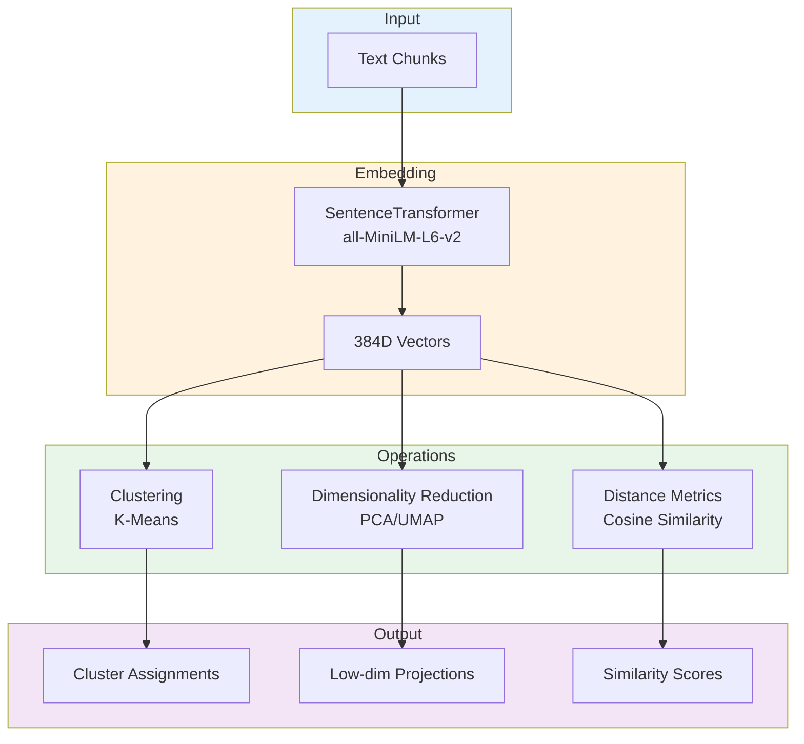
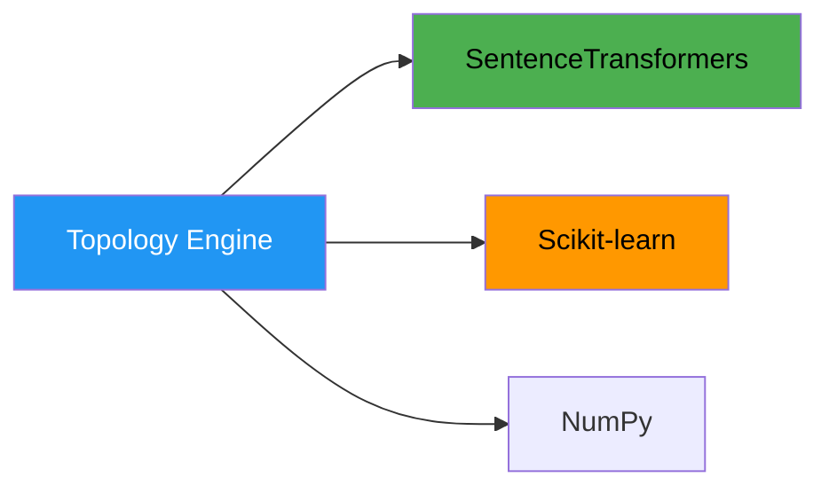
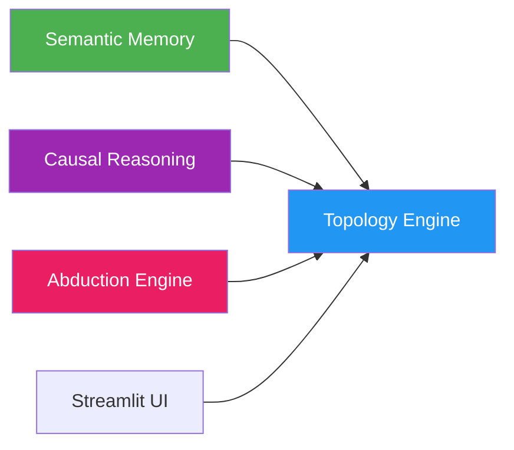

# 🗺️ Topology Engine

**Module**: `core/topology/topology_engine.py`  
**Lines of Code**: 502  
**Purpose**: Semantic space management, clustering, and embedding generation

---

## 🎯 Overview

The Topology Engine is Alexandria's **foundation layer** - it manages the high-dimensional semantic space where all concepts live. It's responsible for generating embeddings, clustering concepts, and providing geometric operations on semantic vectors.

### Core Responsibilities

1. **Generate embeddings**: Text → 384D vectors
2. **Cluster concepts**: Group related ideas
3. **Dimensionality reduction**: 384D → 2D/3D for visualization
4. **Distance metrics**: Measure semantic similarity

---

## 🏗️ Architecture



---

## 🧮 Core Operations

### 1. Embedding Generation

```python
class TopologyEngine:
    def __init__(self, model_name="all-MiniLM-L6-v2"):
        """
        Initialize with SentenceTransformer model.
        
        Model produces 384D embeddings.
        """
        self.model = SentenceTransformer(model_name)
        self.device = torch.device(
            "cuda" if torch.cuda.is_available() else "cpu"
        )
        self.model.to(self.device)
    
    def encode(self, chunks: List[str]) -> np.ndarray:
        """
        Generate embeddings for text chunks.
        
        Args:
            chunks: List of text strings
        
        Returns:
            np.ndarray: shape (len(chunks), 384)
        """
        if not chunks:
            return np.array([]).reshape(0, 384)
        
        embeddings = self.model.encode(
            chunks,
            device=self.device,
            show_progress_bar=False,
            convert_to_numpy=True
        )
        
        # Ensure 384D
        if embeddings.shape[1] != 384:
            # Pad or truncate if needed
            embeddings = self._ensure_384d(embeddings)
        
        return embeddings
```

> [!TIP]
> **Robust Fallback**: If `sentence-transformers` is unavailable or fails, the engine automatically falls back to generating **consistent deterministic embeddings** based on content hash. This ensures the system remains functional (e.g., for testing or in restricted environments) even without the heavy model loaded.


**Performance**:
- **Batch encoding**: ~500 chunks/second
- **Single chunk**: ~2ms
- **GPU acceleration**: 3-5x faster

### 2. Clustering

```python
def cluster_concepts(self, embeddings: np.ndarray, n_clusters: int = 10):
    """
    Cluster embeddings using K-Means.
    
    Args:
        embeddings: [n_samples, 384]
        n_clusters: Number of clusters
    
    Returns:
        labels: Cluster assignment for each sample
        centroids: Cluster centers
    """
    from sklearn.cluster import KMeans
    
    kmeans = KMeans(
        n_clusters=n_clusters,
        random_state=42,
        n_init=10
    )
    
    labels = kmeans.fit_predict(embeddings)
    centroids = kmeans.cluster_centers_
    
    return labels, centroids
```

**Complexity**: O(n × k × i × d)
- n = samples
- k = clusters
- i = iterations
- d = dimensions (384)

### 3. Dimensionality Reduction

```python
def reduce_dimensions(self, embeddings: np.ndarray, method="pca", n_components=2):
    """
    Reduce 384D → 2D/3D for visualization.
    
    Methods:
    - PCA: Fast, linear
    - UMAP: Slower, non-linear, preserves local structure
    """
    if method == "pca":
        from sklearn.decomposition import PCA
        reducer = PCA(n_components=n_components)
    elif method == "umap":
        import umap
        reducer = umap.UMAP(n_components=n_components)
    
    reduced = reducer.fit_transform(embeddings)
    return reduced
```

**Use Cases**:
- 2D: Scatter plots, dashboards
- 3D: Interactive network visualizations

### 4. Similarity Metrics

```python
def cosine_similarity(self, vec_a: np.ndarray, vec_b: np.ndarray) -> float:
    """
    Compute cosine similarity between vectors.
    
    Returns: float in [-1, 1]
    - 1.0 = identical
    - 0.0 = orthogonal
    - -1.0 = opposite
    """
    dot_product = np.dot(vec_a, vec_b)
    norm_a = np.linalg.norm(vec_a)
    norm_b = np.linalg.norm(vec_b)
    
    return dot_product / (norm_a * norm_b + 1e-8)

def batch_similarity(self, query: np.ndarray, corpus: np.ndarray):
    """
    Compute similarity of query against entire corpus.
    
    Optimized with matrix operations.
    """
    # Normalize
    query_norm = query / (np.linalg.norm(query) + 1e-8)
    corpus_norm = corpus / (np.linalg.norm(corpus, axis=1, keepdims=True) + 1e-8)
    
    # Dot product
    similarities = np.dot(corpus_norm, query_norm)
    
    return similarities
```

---

## 🔗 Inter-Module Communication

### **Depends On**:



### **Used By**:



**1. Semantic Memory**
- **Purpose**: Generate embeddings for chunks
- **Call**: `topology.encode(chunks)`
- **When**: Every document indexing

**2. Causal Reasoning**
- **Purpose**: Cluster concepts
- **Call**: `topology.cluster_concepts(embeddings)`

**3. Abduction Engine**
- **Purpose**: Similarity for gap detection
- **Call**: `topology.cosine_similarity(a, b)`

**4. Streamlit UI**
- **Purpose**: Visualizations
- **Call**: `topology.reduce_dimensions(embeddings, method="umap")`

---

## 🎯 Use Cases

### 1. Embed Text

```python
from core.topology.topology_engine import TopologyEngine

engine = TopologyEngine()

# Single chunk
embedding = engine.encode(["machine learning is awesome"])[0]
print(embedding.shape)  # (384,)

# Batch
texts = ["AI", "ML", "Deep Learning"]
embeddings = engine.encode(texts)
print(embeddings.shape)  # (3, 384)
```

### 2. Find Similar Concepts

```python
# Query
query_emb = engine.encode(["neural networks"])

# Corpus
corpus_texts = ["deep learning", "statistics", "biology"]
corpus_emb = engine.encode(corpus_texts)

# Similarities
sims = engine.batch_similarity(query_emb[0], corpus_emb)
print(sims)  # [0.87, 0.23, 0.15] → "deep learning" most similar
```

### 3. Cluster Documents

```python
# Get embeddings
doc_embeddings = engine.encode(all_documents)

# Cluster
labels, centroids = engine.cluster_concepts(doc_embeddings, n_clusters=10)

# Analyze clusters
for i in range(10):
    docs_in_cluster = [doc for doc, label in zip(all_documents, labels) if label == i]
    print(f"Cluster {i}: {len(docs_in_cluster)} documents")
```

### 4. Visualize Semantic Space

```python
# Reduce to 2D
coords_2d = engine.reduce_dimensions(embeddings, method="umap", n_components=2)

# Plot
import matplotlib.pyplot as plt
plt.scatter(coords_2d[:, 0], coords_2d[:, 1])
plt.show()
```

---

## 📊 Model Details

### SentenceTransformer: all-MiniLM-L6-v2

```python
Model: sentence-transformers/all-MiniLM-L6-v2
Architecture: BERT-based
Parameters: 22.7M
Embedding dimension: 384
Max sequence length: 256 tokens
Training data: 1B+ sentence pairs
```

**Why this model?**
- ✅ Fast: 500 chunks/sec on CPU
- ✅ Compact: 384D vs 768D (BERT-base)
- ✅ High quality: SOTA on semantic textual similarity
- ✅ General purpose: Works across domains

---

## 📈 Performance Benchmarks

| Operation | CPU (i7) | GPU (RTX 3080) |
|-----------|----------|----------------|
| Encode 1 chunk | 2ms | <1ms |
| Encode 100 chunks | ~200ms | ~30ms |
| Encode 1000 chunks | ~2s | ~200ms |
| Cosine similarity (single) | <0.1ms | <0.1ms |
| Batch similarity (1 vs 10K) | ~5ms | ~1ms |
| K-Means (10K points, k=10) | ~500ms | N/A |
| PCA (10K → 2D) | ~100ms | N/A |
| UMAP (10K → 2D) | ~5s | N/A |

---

## ⚙️ Configuration

```python
# Model selection
MODEL_NAME = "all-MiniLM-L6-v2"  # Default
# Alternatives:
# - "paraphrase-multilingual-mpnet-base-v2" (multilingual)
# - "all-mpnet-base-v2" (higher quality, slower)

# Clustering
DEFAULT_N_CLUSTERS = 10
CLUSTERING_ALGO = "kmeans"  # or "dbscan", "hierarchical"

# Dimensionality reduction
DIM_REDUCTION_METHOD = "pca"  # or "umap", "tsne"
```

---

## 🔮 Future Enhancements

- [ ] Multi-lingual support
- [ ] Custom fine-tuning on domain data
- [ ] Hierarchical clustering
- [ ] Online/incremental clustering
- [ ] GPU-accelerated similarity search

---

**Last Updated**: 2025-12-01  
**Version**: 1.0  
**Model**: all-MiniLM-L6-v2  
**Status**: Production
