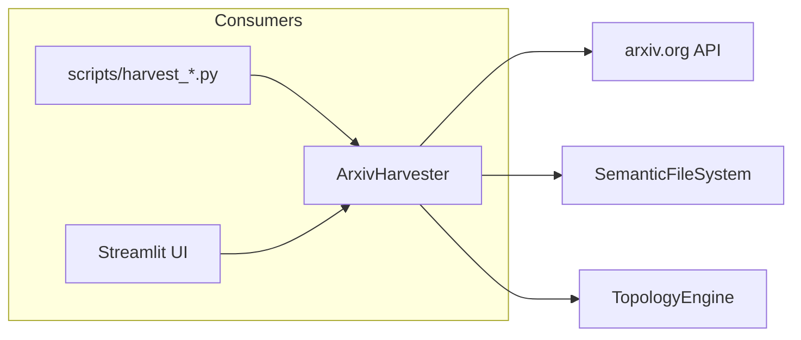

# 🌾 ArxivHarvester

**Module**: `core/utils/harvester.py`  
**Lines**: 126  
**Purpose**: Automatic scientific knowledge acquisition from Arxiv.

---

## Overview

The **ArxivHarvester** searches, downloads, and ingests papers from Arxiv to feed the learning cycle. Focuses on compression, mathematics, and technology topics.

### Pipeline

```
Query → Arxiv Search → Download PDF → Extract Text → Index in SFS
```

---

## Dependencies

| Import | Purpose |
|--------|---------|
| `arxiv` | Python arxiv client |
| `config.settings` | DATA_DIR path |
| `pathlib` | Path operations |

---

## Class: ArxivHarvester

```python
ArxivHarvester(download_dir: str = None)
# Default: data/library/arxiv
```

### Attributes

| Attribute | Type | Description |
|-----------|------|-------------|
| `download_dir` | `str` | PDF download directory |
| `client` | `arxiv.Client` | Arxiv API client |

### Methods

| Method | Signature | Description |
|--------|-----------|-------------|
| `search_papers` | `(query, max_results) → List[Paper]` | Search Arxiv |
| `download_paper` | `(paper) → str` | Download PDF, return path |
| `harvest` | `(query, max_results, topology, sfs) → Dict` | Full pipeline with indexing |

---

## Communication



---

## Usage

### Search Only

```python
from core.utils.harvester import ArxivHarvester

harvester = ArxivHarvester()

# Search for papers
papers = harvester.search_papers("vector quantization", max_results=5)
for p in papers:
    print(f"{p.title[:50]}... by {p.authors[0]}")
```

### Full Harvest with Indexing

```python
from core.topology.topology_engine import TopologyEngine
from core.memory.semantic_memory import SemanticFileSystem

topology = TopologyEngine()
sfs = SemanticFileSystem(topology)

# Harvest and ingest
results = harvester.harvest(
    query="VQ-VAE neural compression", 
    max_results=3,
    topology_engine=topology,
    sfs=sfs
)
print(f"Indexed {results['papers_ingested']} papers")
```

---

**Last Updated**: 2025-12-13  
**Version**: 1.0
