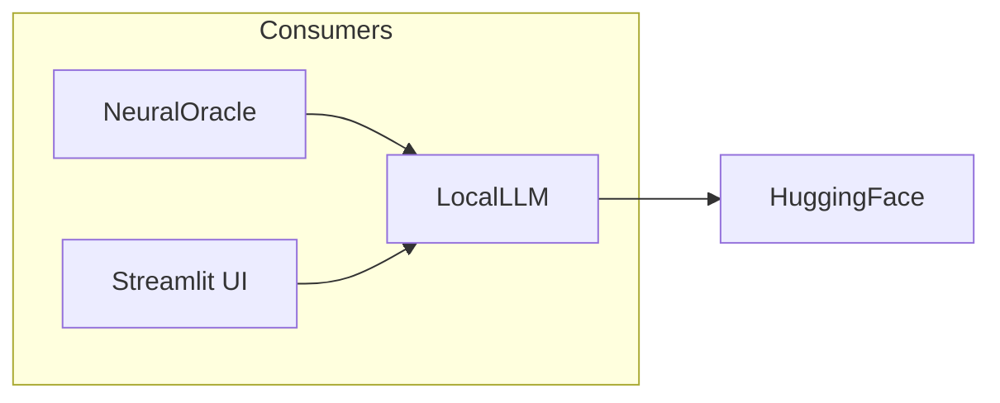

# 🤖 LocalLLM

**Module**: `core/utils/local_llm.py`  
**Lines**: 203  
**Purpose**: Tactical Expert - TinyLlama for fast local RAG synthesis.

---

## Overview

The **LocalLLM** implements the "Tactical Expert" in Alexandria's hybrid architecture:

| Feature | Benefit |
|---------|---------|
| **Local CPU** | i9 AVX512 optimized (Float32) |
| **Zero API cost** | No external API calls |
| **Always available** | Works offline |
| **Fast** | ~2-3 tokens/second on CPU |

### Model

Uses **TinyLlama-1.1B-Chat** — small enough for CPU, capable enough for factual synthesis.

---

## Dependencies

| Import | Purpose |
|--------|---------|
| `torch` | Tensors |
| `transformers` | AutoModelForCausalLM, pipeline |
| `config.settings` | Model name, device |

---

## Class: LocalLLM

```python
LocalLLM(
    model_name: str = settings.LOCAL_LLM_MODEL,
    device: str = settings.LOCAL_LLM_DEVICE
)
```

### Attributes

| Attribute | Type | Description |
|-----------|------|-------------|
| `model_name` | `str` | HuggingFace model ID |
| `device` | `str` | "cpu" or "cuda" |
| `model` | `AutoModelForCausalLM` | Loaded model |
| `tokenizer` | `AutoTokenizer` | Tokenizer |
| `generator` | `Pipeline` | Text generation pipeline |
| `model_loaded` | `bool` | Load status |

### Methods

| Method | Signature | Description |
|--------|-----------|-------------|
| `_load_model` | `()` | Load model and tokenizer |
| `synthesize_facts` | `(query, evidence) → str` | RAG synthesis |
| `_fallback_synthesis` | `(query, evidence) → str` | Template fallback |

---

## Communication



---

## Usage

### Initialize

```python
from core.utils.local_llm import LocalLLM

llm = LocalLLM()
# Loads TinyLlama-1.1B (takes ~10-30 seconds first time)
```

### Synthesize from Evidence

```python
# RAG-style synthesis
evidence = [
    {"content": "VQ-VAE compresses images using discrete codes"},
    {"content": "Product Quantization splits vectors into subspaces"}
]

response = llm.synthesize_facts(
    query="Explain vector quantization",
    evidence=evidence
)
print(response)
```

---

## Internal Details

### CPU Optimization

```python
# Float32 is faster than emulated FP16 on CPU
torch_dtype = torch.float32 if device == "cpu" else torch.float16

# Multi-threading
torch.set_num_threads(8)
```

### Fallback

If model fails, uses template-based synthesis from evidence snippets.

---

**Last Updated**: 2025-12-13  
**Version**: 1.0
