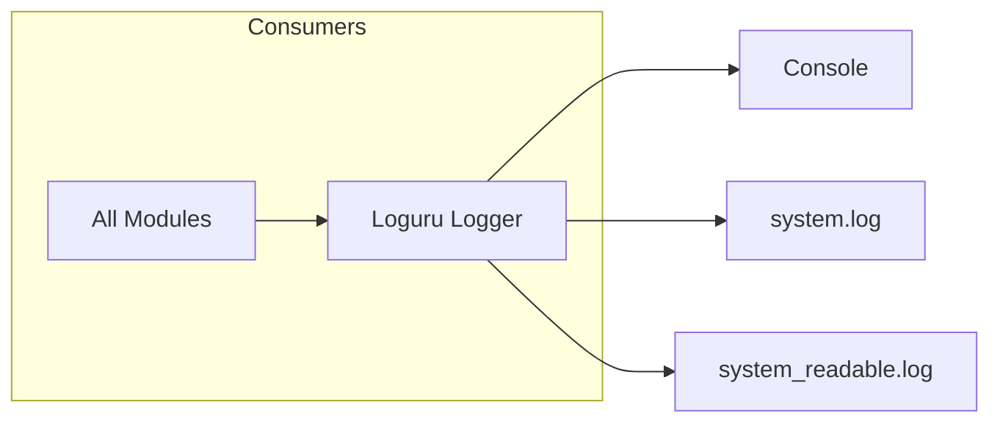

# 📝 Logger

**Module**: `core/utils/logger.py`  
**Lines**: 45  
**Purpose**: Structured logging with Loguru - console, JSON, and readable file outputs.

---

## Overview

Centralized logging configuration using **Loguru**. Sets up three handlers:
1. **Console** — Colorized, INFO level
2. **JSON File** — Structured for analysis, DEBUG level
3. **Readable File** — Human-readable text, INFO level

---

## Dependencies

| Import | Purpose |
|--------|---------|
| `loguru` | Advanced logging library |
| `config.settings` | DATA_DIR path |

---

## Functions

### setup_logger

```python
def setup_logger():
    """Configure all log handlers."""
```

Called automatically on module import.

---

## Handlers

| Handler | Path | Level | Format | Rotation |
|---------|------|-------|--------|----------|
| **Console** | `sys.stderr` | INFO | Colorized | — |
| **JSON** | `data/logs/system.log` | DEBUG | Serialized JSON | 10 MB |
| **Readable** | `data/logs/system_readable.log` | INFO | Text | 10 MB |

---

## Communication



---

## Usage

```python
from loguru import logger

logger.info("Processing document")
logger.debug("Verbose debug info")
logger.warning("Something unexpected")
logger.error("An error occurred")
```

The logger is auto-configured when any Alexandria module imports `core.utils.logger`.

---

**Last Updated**: 2025-12-13  
**Version**: 1.0
