# 🍄 Mycelial Reasoning Network

**Module**: `core/reasoning/mycelial_reasoning.py`  
**Lines of Code**: 800  
**Purpose**: Hebbian learning network over VQ-VAE codebook for emergent reasoning

---

## 🎯 Overview

The Mycelial Reasoning Network implements a **biologically-inspired learning system** that grows connections between semantic codes based on co-occurrence patterns. Like mycelium connecting roots in a forest, it creates pathways between related concepts.

### Key Concept

**"Codes that fire together, wire together"** - Hebbian learning principle

When documents use similar codes, the network strengthens connections between them, enabling:
- ✅ Pattern discovery
- ✅ Concept bridging
- ✅ Semantic propagation
- ✅ Emergent reasoning

---

## 🏗️ Architecture


---

## 📊 Network Structure

### Connection Matrix

```python
connections: np.ndarray  # Shape: [4 heads, 256 codes, 256 codes]
```

**Dimensions**:
- 4 heads (from VQ-VAE product quantization)
- 256 codes per head
- **Total possible connections**: 4 × 256 × 256 = 262,144

**Actual connections** (after 128K observations):
- Active connections: ~2,252
- Network density: **0.86%** (sparse!)
- Average degree: 2.2 connections/code

###  Why Sparse?

Sparsity is **intentional and beneficial**:
- Faster computation (O(active_edges) not O(n²))
- More interpretable (clear semantic pathways)
- Biologically plausible (like real neural networks)

---

## 🔄 Learning Process

### Hebbian Update Algorithm

```mermaid
sequenceDiagram
    participant Doc as New Document
    participant VQ as VQ-VAE
    participant Net as Mycelial Network
    
    Doc->>VQ: Embed & Quantize
    VQ-->>Doc: [h1, h2, h3, h4]
    
    Doc->>Net: observe([h1, h2, h3, h4])
    
    Net->>Net: Strengthen inter-head connections
    Note over Net: conn[0, h1, h2] += lr
    Note over Net: conn[0, h1, h3] += lr
    Note over Net: conn[1, h2, h3] += lr
    Note over Net: ... (all pairs)
    
    Net->>Net: Strengthen intra-head neighbors
    Note over Net: conn[0, h1, h1±5] += lr × 0.1
    
    Net->>Net: Update activation counts
    Note over Net: activation[h, code[h]] += 1
    
    Net->>Net: Periodic decay
    Note over Net: connections *= (1 - decay_rate)
```



### Code Implementation

```python
def observe(self, indices):
    """
    Observe pattern [h1, h2, h3, h4] and update connections.
    
    1. Inter-head: Strengthen connections between codes from different heads
    2. Intra-head: Strengthen neighborhood (codes ±5 from observed)
    3. Track: Increment activation counts
    """
    for i in range(num_heads):
        for j in range(i+1, num_heads):
            # Strengthen inter-head connection
            self.connections[i, indices[i], indices[j]] += learning_rate
            self.connections[j, indices[j], indices[i]] += learning_rate
        
        # Strengthen neighborhood
        for neighbor in range(indices[i] - 5, indices[i] + 6):
            if 0 <= neighbor < 256:
                self.connections[i, indices[i], neighbor] += learning_rate * 0.1
```

---

## 🧠 Reasoning Process

### Activation Propagation


### Algorithm

```python
def propagate(self, indices, steps=3):
    """
    Propagate activation through network.
    
    Args:
        indices: [h1, h2, h3, h4] - initial codes
        steps: Number of propagation steps
    
    Returns:
        activation: [4, 256] - final activation pattern
    """
    # Initialize activation
    activation = np.zeros((4, 256))
    for h in range(4):
        activation[h, indices[h]] = 1.0
    
    # Propagate
    for step in range(steps):
        new_activation = activation.copy()
        
        for h in range(4):
            # Spread activation via connections
            for code in range(256):
                if activation[h, code] > threshold:
                    # Activate connected codes
                    new_activation[h] += connections[h, code, :] * activation[h, code]
        
        # Normalize & apply activation function
        activation = normalize(new_activation)
    
    return activation
```

---

## 🔗 Inter-Module Communication

### **Depends On**:


**1. VQ-VAE** (`core/reasoning/vqvae/model_wiki.py`)
- **Purpose**: Encode embeddings → discrete codes
- **Call**: `vqvae.encode(embedding)` → [h1, h2, h3, h4]
- **When**: Every observation and reasoning step

**2. MycelialVQVAE Wrapper** (`core/reasoning/mycelial_reasoning.py`)
- **Purpose**: Integration layer
- **Provides**: `encode()`, `observe()`, `reason()`

### **Used By**:


**1. Training Scripts** (`scripts/train_mycelial.py`, `scripts/populate_mycelial.py`)
- **Purpose**: Train network on document corpus
- **Call**: `mycelial.observe(codes)` in batch

**2. Abduction Engine** (`core/reasoning/abduction_engine.py`)
- **Purpose**: Find semantic bridges
- **Call**: `mycelial.find_bridges(codes_a, codes_b)`

**3. Streamlit UI** (`interface/pages/2_🍄_Mycelial_Brain.py`)
- **Purpose**: Visualize network
- **Call**: `mycelial.get_network_stats()`, `mycelial.get_hub_codes()`

---

## 📊 Key Methods

### Core API

| Method | Purpose | Complexity |
|--------|---------|------------|
| `observe(indices)` | Learn from pattern | O(h²) = O(16) |
| `observe_batch(batch)` | Batch learning | O(n × h²) |
| `propagate(indices, steps)` | Spread activation | O(k × c²) |
| `reason(indices)` | Full pipeline | O(k × c²) |
| `get_hub_codes(top_k)` | Find hubs | O(c²) |
| `find_bridges(a, b, top_k)` | Semantic bridges | O(c) |

Where:
- `h` = num_heads (4)
- `c` = codebook_size (256)
- `k` = propagation_steps (3-5)
- `n` = batch_size

### Advanced Features

**1. Sequential Learning**

```python
def observe_sequence(self, prev, next):
    """
    Learn temporal transitions: prev → next
    
    Strengthens connections that predict next state from previous.
    """
```

**2. Selective Decay**

```python
def decay_selective(self, steps_since_use=100):
    """
    Decay connections not used recently.
    
    Prevents network from growing indefinitely.
    """
```

**3. Bridge Finding**

```python
def find_bridges(self, codes_a, codes_b, top_k=5):
    """
    Find codes that connect two concepts.
    
    Returns: Codes with high connectivity to both A and B.
    """
```

---

## 💾 State Persistence

### Save Format (NPZ)

```python
{
    "connections": np.ndarray,      # [4, 256, 256] - Connection weights
    "activation_counts": np.ndarray, # [4, 256] - Usage frequency
    "observations": int,             # Total observations
    "last_decay": int,               # Steps since last decay
    "config": dict                   # Network configuration
}
```

### Auto-Save

Network automatically saves state to `data/mycelial_state.npz` after modifications.

---

## 🎯 Use Cases

### 1. **Training**

```python
from core.reasoning.mycelial_reasoning import MycelialVQVAE

# Load pre-trained VQ-VAE + mycelial network
mvq = MycelialVQVAE.load_default()

# Train on corpus
for document in corpus:
    embedding = embed(document)
    codes = mvq.encode(embedding)
    mvq.observe(codes)  # Network learns!
```

### 2. **Enhanced Retrieval**

```python
# Original query codes
query_codes = mvq.encode(query_embedding)

# Reason: propagate + synthesize
enhanced_codes, activation = mvq.reason(query_codes, steps=3)

# enhanced_codes now includes related concepts!
```

### 3. **Concept Bridging**

```python
# Find codes connecting "AI" and "Physics"
ai_codes = mvq.encode(embed("artificial intelligence"))
physics_codes = mvq.encode(embed("quantum mechanics"))

bridges = mvq.mycelial.find_bridges(ai_codes, physics_codes, top_k=5)

# bridges = codes that appear in both domains
```

---

## 📈 Network Statistics

### Current Production Network

After 128,692 observations:

```python
{
    "total_observations": 128692,
    "active_connections": 2252,
    "network_density": 0.0086,  # 0.86%
    "avg_degree": 2.2,
    "max_connection_strength": 0.85,
    "hub_codes": [0, 1, 255, 254, ...]  # Top 20
}
```

### Hub Codes

Codes with highest connectivity (>50 connections):

| Code | Head | Connections | Interpretation |
|------|------|-------------|----------------|
| 0 | All | 127 | Common start token |
| 255 | All | 115 | Common end token |
| 128 | 0 | 89 | Mid-range concepts |
| ... | ... | ... | ... |

---

## ⚙️ Configuration

```python
@dataclass
class MycelialConfig:
    num_heads: int = 4              # VQ-VAE heads
    codebook_size: int = 256        # Codes per head
    learning_rate: float = 0.01     # Hebbian update strength
    decay_rate: float = 0.001       # Connection decay
    propagation_steps: int = 3      # Reasoning depth
    activation_threshold: float = 0.1  # Minimum to propagate
    connection_threshold: float = 0.05  # Minimum to save
```

---

## 🔬 Emergent Behavior

### Pattern Discovery

Network automatically discovers:
- **Domain clusters**: Codes used in similar contexts
- **Concept bridges**: Codes connecting different domains
- **Temporal patterns**: Sequential code transitions

### Example: Scientific Papers

After training on CS + Physics papers:

```
Hub Code 42:
├─ Strong connections to: [43, 44, 41] (topic cluster)
├─ Bridge to Physics: Code 127
└─ Usage: 1,247 times in 892 documents

Interpretation: Code 42 = "machine learning" concept
```

---

## ⚠️ Limitations

1. **Memory**: O(h × c²) = 262,144 floats (~1 MB)
2. **Propagation cost**: O(k × c²) per query
3. **No semantic labels**: Codes are abstract
4. **Fixed codebook**: Can't add new codes after training

---

## 🔮 Future Enhancements

- [ ] Dynamic codebook expansion
- [ ] Hierarchical propagation
- [ ] Attention-based weighting
- [ ] Multi-scale temporal patterns
- [ ] Automatic hub interpretation

---

**Last Updated**: 2025-12-01  
**Version**: 1.0  
**Status**: Production (128K+ observations trained)
