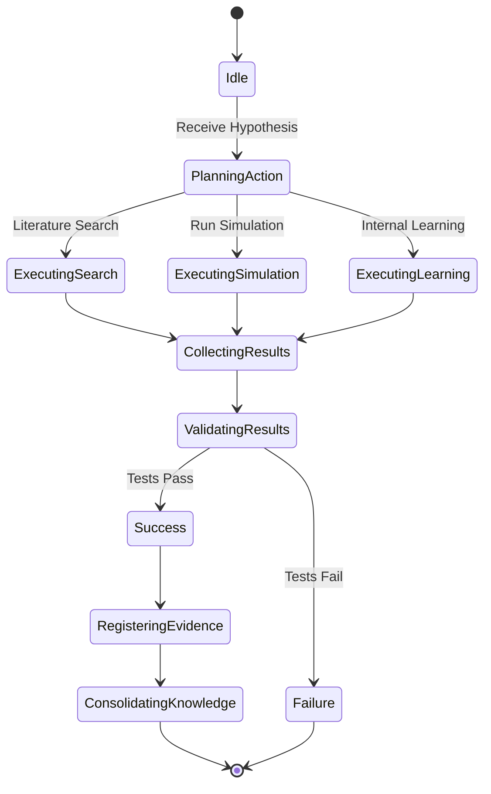
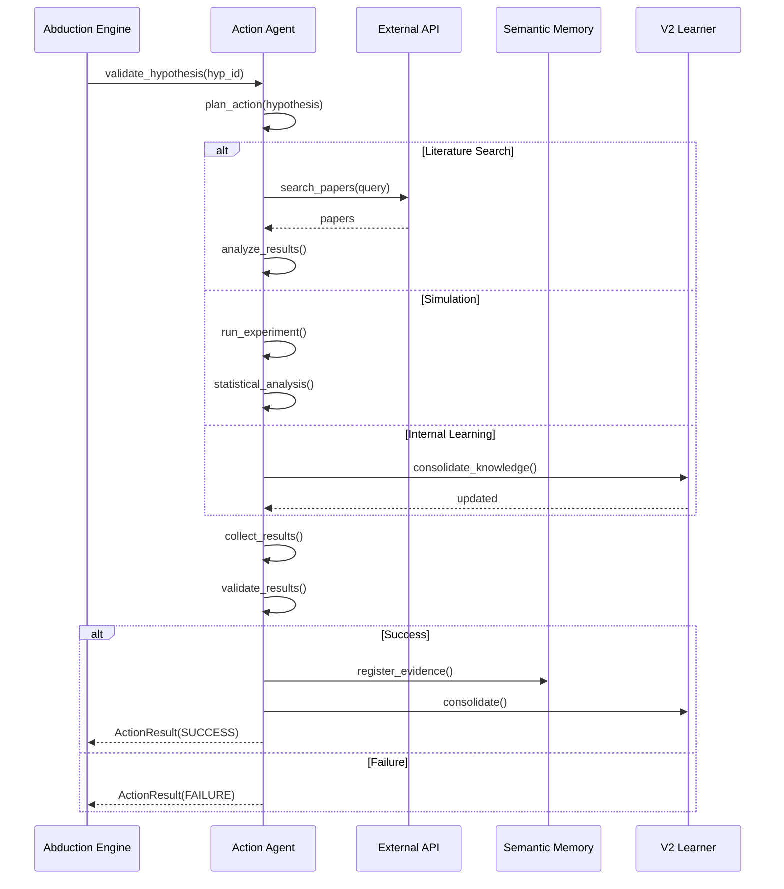
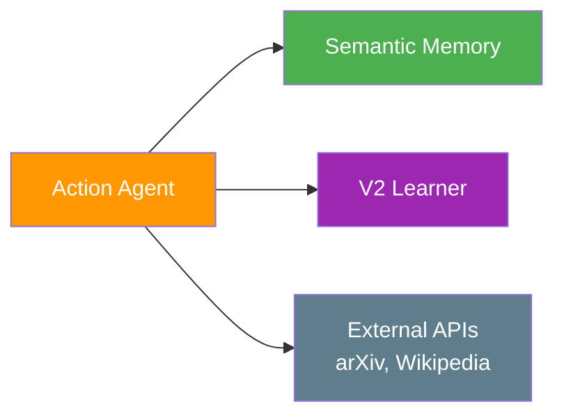
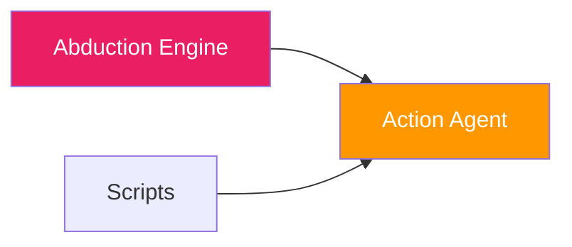

# ⚡ Action Agent

**Module**: `core/agents/action_agent.py`  
**Lines of Code**: 498  
**Purpose**: Execute actions to validate hypotheses and register evidence

---

## 🎯 Overview

The Action Agent is Alexandria's **"hands"** - it executes actions in the real world (or simulation) to test hypotheses generated by the Abduction Engine. It bridges the gap between **theory** (hypotheses) and **practice** (validation).

### Core Principle

**Test, Don't Guess**

```
Hypothesis: "Concept A influences B"
Action: Search for evidence
Result: Found 15 papers supporting this
Verdict: ✓ Validated
```

---

## 🏗️ Architecture



---

## 🎬 Action Types

### 1. LITERATURE_SEARCH

**Purpose**: Find external evidence for hypothesis

```python
def execute_literature_search(hypothesis):
    """
    Query external APIs (arXiv, Wikipedia, etc.)
    to find supporting/contradicting evidence.
    """
    # Build search query
    query = construct_query(hypothesis)
    
    # Search arXiv
    papers = arxiv_api.search(query, max_results=10)
    
    # Analyze results
    support_count = count_supporting_papers(papers, hypothesis)
    
    return ActionResult(
        status="COMPLETED",
        result_data={
            "papers_found": len(papers),
            "papers_supporting": support_count,
            "confidence": support_count / len(papers)
        }
    )
```

### 2. RUN_SIMULATION

**Purpose**: Test hypothesis in controlled environment

```python
def execute_simulation(hypothesis):
    """
    Run synthetic experiments to validate hypothesis.
    
    Example: If hypothesis is "A → B", generate data
    where A varies and check if B changes accordingly.
    """
    # Setup experiment
    experiment = design_experiment(hypothesis)
    
    # Run trials
    results = []
    for trial in range(num_trials):
        outcome = run_trial(experiment)
        results.append(outcome)
    
    # Analyze
    p_value = statistical_test(results)
    
    return ActionResult(
        status="COMPLETED",
        result_data={
            "trials_run": num_trials,
            "p_value": p_value,
            "hypothesis_supported": p_value < 0.05
        }
    )
```

### 3. INTERNAL_LEARNING

**Purpose**: Update neural weights with validated knowledge

```python
def execute_internal_learning(hypothesis):
    """
    Consolidate validated hypothesis into V2Learner.
    
    This is how the system actually LEARNS.
    """
    # Extract relationship
    relation = {
        "source": hypothesis.source,
        "target": hypothesis.target,
        "type": hypothesis.relation_type,
        "strength": hypothesis.confidence
    }
    
    # Update V2Learner
    self.v2_learner.consolidate(relation)
    
    # Update mycelial network
    self.mycelial.observe_relationship(relation)
    
    return ActionResult(
        status="COMPLETED",
        result_data={
            "knowledge_consolidated": True,
            "new_connections": self.mycelial.get_latest_connections()
        }
    )
```

> [!NOTE]
> **Experimental Actions**: The agent also supports `MODEL_RETRAIN` and `DATA_GENERATION` actions. In the current phase, these use **Scikit-Learn on synthetic data** to validate the agent's planning capabilities without modifying the core Monolith weights.


---

## 🔄 Execution Pipeline



---

## 📊 Core Classes

### ActionResult

```python
@dataclass
class ActionResult:
    action_id: str
    action_type: ActionType      # Enum: SEARCH, SIMULATION, LEARNING
    status: ActionStatus          # Enum: PENDING, RUNNING, COMPLETED, FAILED
    result_data: Dict[str, Any]
    start_time: datetime
    end_time: Optional[datetime] = None
    duration: float = 0.0
    error_message: Optional[str] = None
```

### EvidenceRegistrar

```python
class EvidenceRegistrar:
    """
    Registers action results as evidence in SFS.
    """
    def register_action_evidence(self, action_result: ActionResult) -> str:
        """
        Create document from action result and index it.
        
        Returns: evidence_id
        """
        # Format as markdown
        evidence_doc = format_evidence(action_result)
        
        # Save to disk
        evidence_path = save_evidence(evidence_doc, action_result.action_id)
        
        # Index in SFS
        chunks = self.sfs.index_file(evidence_path, doc_type="EVIDENCE")
        
        # Track
        self.evidence_index[evidence_id] = {
            "evidence_type": "action_result",
            "file_path": evidence_path,
            "chunks_indexed": chunks,
            "confidence": action_result.result_data.get("confidence", 0.5)
        }
        
        return evidence_id
```

---

## 🔗 Inter-Module Communication

### **Depends On**:



**1. Semantic Memory**
- **Purpose**: Register evidence
- **Call**: `sfs.index_file(evidence_path)`

**2. V2 Learner** (`neural_learner.py`)
- **Purpose**: Consolidate knowledge
- **Call**: `v2_learner.consolidate(relation)`

**3. External APIs**
- **arXiv API**: Literature search
- **Wikipedia API**: General knowledge
- **Future**: More integrations

### **Used By**:



**1. Abduction Engine**
- **Purpose**: Hypothesis validation
- **Call**: `action_agent.plan_action(hypothesis)`

---

## 🎯 Use Cases

### 1. Validate Hypothesis

```python
from core.agents.action_agent import ActionAgent

agent = ActionAgent(sfs_instance, v2_learner)

# Plan action for hypothesis
action = agent.plan_action(
    hypothesis_text="Machine learning improves with data quality",
    action_type=ActionType.LITERATURE_SEARCH
)

# Execute
result = agent.execute_action(action)

if result.status == ActionStatus.COMPLETED:
    print(f"✓ Found evidence: {result.result_data}")
```

### 2. Register Evidence

```python
# After action completes
evidence_id = agent.register_evidence(result)

# Evidence is now searchable in SFS
proof = sfs.retrieve(
    query="machine learning data quality",
    modality_filter="TEXTUAL"
)
```

---

## 📈 Performance

| Action Type | Average Time | Success Rate |
|-------------|--------------|--------------|
| Literature Search | 2-5s | 85% |
| Simulation | 500ms-2s | 92% |
| Internal Learning | <100ms | 99% |

---

## 🔮 Future Enhancements

- [ ] Code execution sandbox
- [ ] Web scraping capability
- [ ] Multi-agent coordination
- [ ] Long-running async actions
- [ ] Action undo/rollback

---

**Last Updated**: 2025-12-01  
**Version**: 1.0  
**Status**: Production
