# 💀 Cognitive Nemesis: User Manual

**"Efficiency is the ultimate sophistication."**

This manual documents the **Cognitive Nemesis** architecture, a resource-efficient, multi-agent cognitive layer atop the Alexandria system. It is designed to run on consumer hardware (Lite Mode) whilst delivering "operational excellence" through specialized reasoning profiles.

---

## 🏗️ Architecture

The Nemesis architecture introduces three key components:

1.  **Multi-Agent Orchestrator**: Manages specialized agents accessing a shared `MycelialReasoning` graph.
2.  **Reasoning Profiles**: Distinct cognitive personalities (Scout, Judge, Weaver).
3.  **Lite Mode**: Aggressive resource management (Pruning) for local deployment.

```mermaid
graph TD
    User -->|Text| Orch[Multi-Agent Orchestrator]
    
    subgraph SharedMind [Shared Mycelial Memory]
        Graph[Sparse Graph]
        Lance[Vector Store]
    end
    
    subgraph Agents [Reasoning Profiles]
        Scout[🕵️ The Scout]
        Judge[⚖️ The Judge]
        Weaver[🕸️ The Weaver]
    end
    
    Orch --> Scout & Judge & Weaver
    Scout & Judge & Weaver <-->|Read/Write| SharedMind
    
    subgraph Governance [Free Energy Principle]
        Orch -->|Min EFE| FEP[Free Energy Minimization]
    end
```



---

## 🎭 The Three Faces (Agents)

Each agent uses **Active Inference** but with tuned parameters (Risk, Ambiguity, Novelty).

| Profile | Archetype | Function | Personality |
| :--- | :--- | :--- | :--- |
| **The Scout** | Explorer | Finds new information & novelty. | Fast, High Temperature, High Novelty Bonus. |
| **The Judge** | Verifier | Validates truth & prunes weak links. | Slow, Critical, Low Risk Tolerance. |
| **The Weaver** | Architect | Connects disparate concepts. | Balanced, Focus on Graph Density. |

### Configuration (`core/learning/profiles.py`)
Profiles are defined as dataclasses and can be hot-swapped or extended.

---

## ⚡ Lite Mode (Local Optimization)

Designed for 8GB-16GB RAM machines.

### Features
*   **Graph Pruning**: Automatically removes "orphaned" or weak nodes when graph size > 50k nodes.
*   **Vector Bypass**: Can skip loading heavy embedding models if vectors exist in LanceDB.
*   **Lazy Loading**: Agents only spin up when invoked.

### Usage
To activate Lite Mode:
```python
from core.learning.integration_layer import IntegrationConfig, SystemProfile

config = IntegrationConfig(profile=SystemProfile.LITE)
# Limits: 8GB RAM, 50k Graph Nodes, 3 PC Iterations
```

---

## 🛠️ Integration with Alexandria

The Nemesis layer sits between the **Ingestion** (LanceDB) and the **User**.

1.  **Ingestion**: Papers enter LanceDB (155k+ chunks).
2.  **Weaving**: *The Weaver* runs in background, connecting these chunks in the Mycelial Graph.
3.  **Querying**: *The Scout* explores the graph to answer user queries.
4.  **Maintenance**: *The Judge* periodically cleans the graph (Lite Mode maintenance).

---

## 📄 Scripts

*   `scripts/debug/verify_nemesis.py`: Verify connectivity and agent spawning.
*   `scripts/debug/test_nemesis_integration.py`: Test agents on real LanceDB data.
*   `scripts/train_mycelial.py`: Train the graph (Legacy, being updated for Nemesis).

---

**Last Updated**: 2025-12-05
**Status**: Operational
